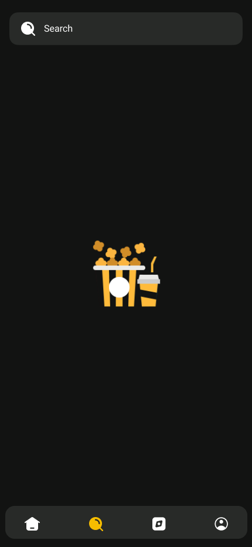
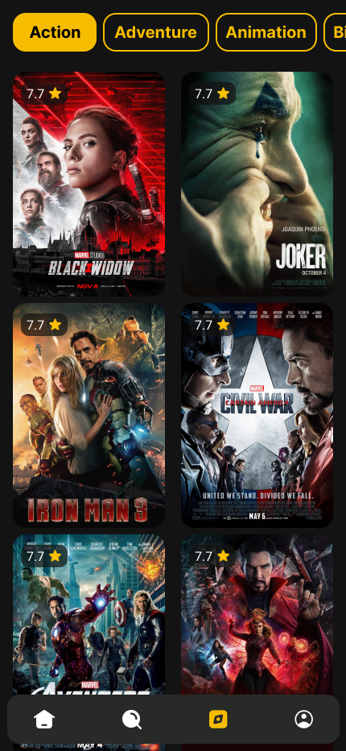
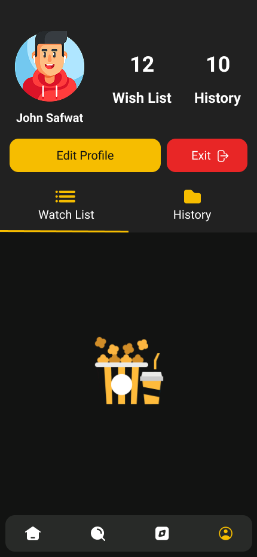
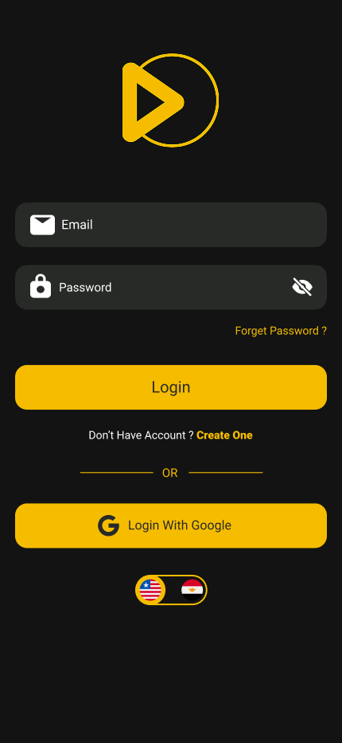
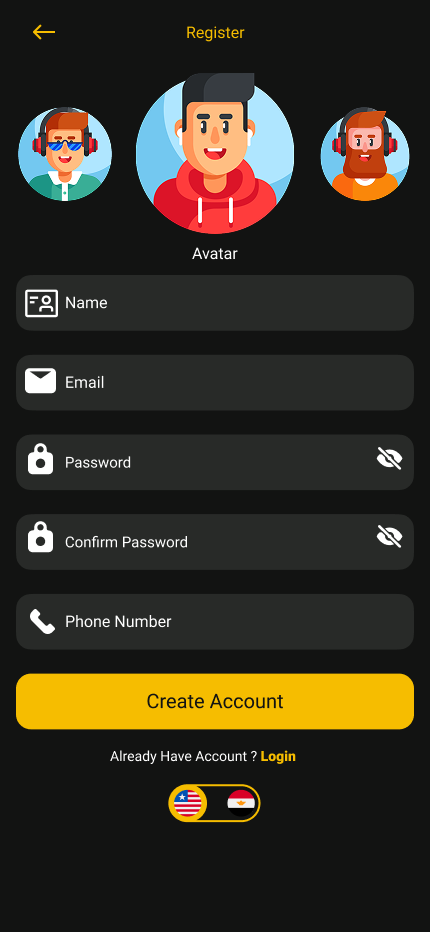

# 🎬 Movies App – Flutter Clean Architecture

A modern **Entertainment & Movies Browsing App** built with **Flutter**, inspired by streaming platforms and designed fully in **Dark Mode**.  
The app follows **Clean Architecture**, **BLoC**, **Dependency Injection**, and uses a high-quality UI from the linked Figma design.

---

# 👥 Team Members
- **Afnan Ali**  
- **Mariam Ragab**  
- **Abdallah Ahmed**

---

# 📌 Table of Contents
- Features  
- Technical Implementation  
- UI Preview  
- Project Structure  
- Packages Used
- Setup Guide  

---

# ⭐ Features

## 🔑 1. Authentication
- Login / Register using BLoC  
- Form validation  
- Error handling  
- State management (loading, success, failure)  

## 🏠 2. Home
- Trending movies  
- Latest movies  
- Popular movies  
- Horizontal carousels  
- Modern movie cards  
- Smooth loading states  

## 🎬 3. Movie Details
- Full movie preview image  
- Rating, year, runtime  
- Genres   
- Summary / Description  
- Open external movie URL using **url_launcher**   

## 🔍 4. Search
- Real-time search   
- Movie previews  
- Search suggestions  
- Handles empty results  
- Clean Architecture + BLoC  

## 📚 5. Browse
- Browse by genre  
- Horizontal & vertical lists  
- Filters by category  
- API integration for genres  

## 👤 6. Profile
- Show user profile info  
- Profile picture + name   
- Uses local storage for history
- watch later lists

## ✏️ 7. Edit Profile
- Edit username  
- Edit profile image
- Reset Password
- Instant UI refresh  

---

# 🛠 Technical Implementation

### 🎨 Frontend (Flutter)
- Flutter 3.x  
- Dart Clean Architecture  
- Responsive UI using **flutter_screenutil**  
- Carousel using **carousel_slider**
- Fully dark-themed UI  

### ⚙️ Architecture
Based on Clean Architecture layers:
Presentation → BLoC
Domain → Entities, Repositories, UseCases
Data → API, Models, DTOs

Benefits:
- Highly scalable  
- Easy to test  
- Easy to add new features  

### 🔄 State Management – BLoC
Used for:
- Auth  
- Home  
- Search  
- Details  
- Profile  
- Browse  

Each feature has its own:  
- Events  
- States  
- Bloc  

### 🌍 Backend Integration
- REST API using **Dio**  
- Dependency injection using **Injectable + GetIt**  

---

# 🎨 UI Preview (Based on Figma)

## 🏠 Home
<p>
  
</p>

## 🎬 Details
<p>
  
</p>

## 🔍 Search
<p>
  
  
</p>

## 📚 Browse
<p>
  
</p>

## 👤 Profile
<p>
  
  
</p>

## ✏️ Edit Profile
<p>
  
  
</p>

## 🔑 Authentication
<p>
  
  
  
</p>

## 📸 Splash & OnBoarding
<p>
  
  
  
  
  
  
  
</p>


---

## 📂 Project Structure
lib/
│
├── core/
│   ├── network/
│   ├── error/
│   ├── constants/
│   └── utils/
│
├── features/
│   ├── auth/
│   ├── home/
│   │   ├── data/
│   │   │   ├── datasources/
│   │   │   │   └── home_remote_data_source.dart
│   │   │   ├── models/
│   │   │   │   └── movie_model.dart
│   │   │   └── repositories/
│   │   │       └── home_repository_impl.dart
│   │   │
│   │   ├── domain/
│   │   │   ├── entities/
│   │   │   │   └── movie_entity.dart
│   │   │   ├── repositories/
│   │   │   │   └── home_repository.dart
│   │   │   └── usecases/
│   │   │       └── get_movies_usecase.dart
│   │   │
│   │   ├── presentation/
│   │   │   ├── blocs/
│   │   │   │   ├── home_bloc.dart
│   │   │   │   ├── home_event.dart
│   │   │   │   └── home_state.dart
│   │   │   ├── screens/
│   │   │   │   └── home_screen.dart
│   │   │   └── widgets/
│   │   │       ├── movie_card.dart
│   │   │       └── movies_carousel.dart
│   │
│   ├── browse/
│   ├── details/
│   ├── search/
│   ├── profile/
│   │   ├── view_profile/
│   │   └── edit_profile/
│
├── di/
│   └── injectable.config.dart
│
├── main.dart
└── movies_app.dart

---

# 📦 Packages Used

| Package | Purpose |
|--------|---------|
| flutter_bloc | State management |
| dio | API requests |
| injectable / get_it | Dependency injection |
| carousel_slider | Carousels |
| url_launcher | Open browser links |
| flutter_screenutil | Responsive UI |
| equatable | Value comparison |
| multiavatar | avaters |


---

# ⚙️ Setup Guide

### 1️⃣ Clone the Project
```bash
git clone https://github.com/your-username/movies_app.git
cd movies_app

2️⃣ Install Dependencies
flutter pub get

3️⃣ Generate Dependency Injection
flutter pub run build_runner build --delete-conflicting-outputs

4️⃣ Run Project
flutter run


